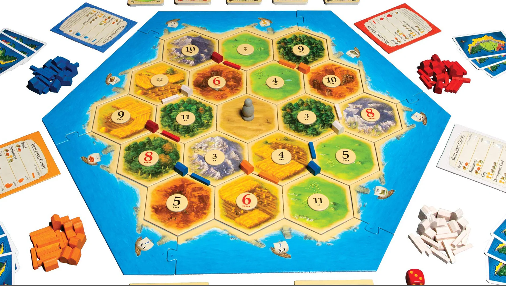

Board view:

# Catan Board Model Definition

## Overview
- **Tile**: A hexagonal terrain piece. Produces resources.
- **Settle (Intersection)**: A corner shared by up to 3 tiles. Players build Settlements and Cities here.
- **Road (Edge)**: A path connecting two intersections.

## 1. Tile Class
Represents a hexagonal terrain tile.
*   `terrain`: (Enum/Str) Type of resource ('forest'->wood, 'hill'->brick, 'pasture'->sheep, 'field'->wheat, 'mountain'->ore, 'desert').
*   `token_num`: (Int) The dice number (2-12) that triggers this tile.
*   `has_robber`: (Bool) `True` if the Robber is currently on this tile (blocks resources).
*   `neighbors`: (List[Tile]) Adjacent hexes (Size 6).
    *   `[0]`=TopLeft(NW), `[1]`=TopRight(NE), `[2]`=Right(E), `[3]`=BottomRight(SE), `[4]`=BottomLeft(SW), `[5]`=Left(W).
*   `corners`: (List[Settle]) The 6 vertices of the hex (Size 6).
    *   `[0]`=Top, `[1]`=TopLeft, `[2]`=BottomLeft, `[3]`=Bottom, `[4]`=BottomRight, `[5]`=TopRight.
*   `borders`: (List[Road]) The 6 edges of the hex (Size 6).
    *   Indices correspond to `neighbors` directions.

## 2. Settle Class (Vertex)
Represents an intersection where 3 hexes meet.
*   `owner`: (Int) `0`=Unoccupied, `1-4`=Player ID, `-1`=Unbuildable (Distance Rule violations).
*   `building`: (Int) `0`=None, `1`=Settlement (1 VP), `2`=City (2 VP).
*   `adj_hexes`: (List[Tile]) The 3 tiles touching this corner (used for resource distribution).
    *   `[0]`=Left, `[1]`=Right, `[2]`=Vertical (Up/Down depending on orientation).
*   `adj_roads`: (List[Road]) The 3 roads branching from this corner (used for connectivity).
*   `port`: (Str/None) Type of harbor if present (e.g., "Generic 3:1", "Wool 2:1").

## 3. Road Class (Edge)
Represents the path between two Settlements.
*   `owner`: (Int) `0`=Unoccupied, `1-4`=Player ID.
*   `connects`: (List[Settle]) The 2 Settlements this road links (Start/End).

## 4. Board Class
Manages the global state, the graph of connected components, and coordinate lookups.

### Data Structures
*   `hex_grid`: (2D List[Tile]) A 2D array representation of the board for coordinate access.
    *   **Coordinate System**: Axes are Horizontal (x/col) and Diagonal Left-Down (y/row).
    *   **Ocean Layer**: The playable board is surrounded by a ring of "Ocean" tiles (some containing Ports).
    *   **Mapping**:
        *   `[0, 0]` = Top-left Ocean/Port tile.
        *   `[1, 1]` = Top-left Resource Tile (first row of actual terrain).
        *   `[1, 3]` = Top-right Resource Tile (skips indices due to hex stagger/offset).
*   `vertex_grid`: (2D List[Settle]) A flattened 2D array for accessing intersection points (Settlements) by row.
    *   **Row Flattening**: The "zig-zag" pattern of vertices (peaks and valleys) along a hex row is flattened into a linear list.
    *   **Example**: The top 3 vertices (peaks) of the top row of 3 tiles are stored sequentially in `vertex_grid[0]`.
*   `graph_network`: (Graph Structure) The logical web of pointers.
    *   Ensures every `Tile` points to its valid neighbors.
    *   Ensures every `Settle` points to adjacent tiles and roads.
    *   Ensures every `Road` points to its two endpoints.

### Initialization & Methods
*   `initialize_graph()`: 
    1.  Generates the `hex_grid` (including oceans).
    2.  Generates the `vertex_grid` (flattening the zig-zags).
    3.  Creates `Road` objects to bridge adjacent `Settles`.
    4.  Links all pointers (Tile neighbors, Settle adjacencies).
*   `place_ports()`: Assigns port properties to specific Ocean tiles and their touching coastal Settlements.
*   `robber_tile`: (Tile) Pointer to the tile currently occupied by the Robber.

## 5. Player Class
Represents a player in the game, tracking their assets, hand, and AI-related state.

### Gameplay Variables
*   `player_id`: (Int) Unique identifier (1-4).
*   `settlements`: (List[Settle]) All settlements and cities this player has built.
    *   Cities are distinguished by `settle.building == 2`.
*   `roads`: (List[Road]) All roads this player has placed on the board.
*   `hand`: (Dict[Str, ufloat]) Resource cards in hand.
    *   Keys: `'wood'`, `'brick'`, `'sheep'`, `'wheat'`, `'ore'`.
    *   Values: value is only unknown when robbing happens.
*   `dev_cards`: (Dict[Str, UFloat]) Development cards the player holds.
    *   Keys: `'knight'`, `'vp'` (Victory Point), `'road_build'`, `'year_plenty'`, `'monopoly'`.
    *   Values: UFloat for the same hidden-information reasoning.
*   `vp`: (ufloat) Publicly visible Victory Points (from settlements, cities, Longest Road, Largest Army).
*   `devs_played`: (list) storing what dev cards the person played

*   `knights_played`: (Int) Number of Knight cards played (used for Largest Army calculation).

### AI / Strategy Variables
*   `skill_model`: (NeuralNet / Classifier) A model representing this player's skill or play-style.
    *   Could be used to predict their likely moves or to simulate opponents of varying difficulty.
*   `threat_target`: (Int / Player) Tracks which opponent this player perceives as the biggest threat.
    *   Influences decisions like Robber placement and trade refusals.

### Notes
*   `hand` and `dev_cards` use **UFloat** (uncertain float) to support probabilistic tracking of hidden information by AI agents or opponents.
*   `skill_model` is a placeholder for future ML integration (e.g., behavior cloning, reinforcement learning policy).

## 6. Deck Class
Manages the shared supply of Resource Cards and Development Cards available to all players.

### Resource Bank
*   `resource_bank`: (Dict[Str, Int]) The pool of resource cards remaining in the game.
    *   Keys: `'wood'`, `'brick'`, `'sheep'`, `'wheat'`, `'ore'`.
    *   Values: Count of cards left (starts at 19 each in standard Catan).
    *   **Note**: When the bank runs out of a resource, players cannot receive more of that type.

### Development Card Deck
*   `dev_remaining`: (Int) Total number of development cards left in the deck.
*   `dev_probs`: (Dict[Str, Float]) Probabilistic model of what dev cards remain.
    *   Keys: `'knight'`, `'vp'`, `'road_build'`, `'year_plenty'`, `'monopoly'`.
    *   Values: Estimated probability or expected count of each type remaining.
    *   **Standard Distribution** (25 total): 14 Knights, 5 VP, 2 Road Building, 2 Year of Plenty, 2 Monopoly.
*   `update_dev_probs(event)`: Updates `dev_probs` when new information is revealed.
    *   **Triggers**: A player plays a dev card, a VP card is revealed at game end, etc.

### Notes
*   The resource bank is public information (anyone can count cards).
*   The dev deck composition is hidden, so `dev_probs` uses Bayesian inference to estimate what's left based on observed plays.
*   This is updated when say a player held on to his dev for x turns (reduced likelihood of being knight, year-of-plenty)

---

## 7. GameState Class `[ADDED]`
Tracks the current turn, phase, and global game conditions. Essential for AI to know what actions are legal.

### Turn Tracking
*   `turn_number`: (Int) Current turn count (starts at 1).
*   `current_player`: (Int) Player ID (1-4) whose turn it is.
*   `phase`: (Enum/Str) Current phase within the turn:
    *   `'setup_settle'` — Placing initial settlement (turns 1-2 per player).
    *   `'setup_road'` — Placing initial road after settlement.
    *   `'roll'` — Must roll dice.
    *   `'discard'` — Players with >7 cards must discard half (after a 7 is rolled).
    *   `'robber'` — Must move the robber and steal (after a 7 or Knight).
    *   `'main'` — Main phase: build, trade, play dev card.
    *   `'trade'` — Sub-phase for active trade negotiation.
    *   `'end'` — Turn is complete, awaiting next player.
*   `dice_result`: (Tuple[Int, Int]) The two dice values from the last roll (e.g., `(3, 5)`).
*   `dice_sum`: (Int) Convenience: sum of `dice_result`.

### Discard Phase Tracking `[ADDED]`
*   `must_discard`: (Dict[Int, Int]) Players who must discard on a 7.
    *   Keys: Player IDs, Values: Number of cards they must discard.
*   `has_discarded`: (Set[Int]) Player IDs who have completed discarding.

### Special Awards
*   `longest_road_holder`: (Int/None) Player ID holding Longest Road (≥5 roads), or `None`.
*   `longest_road_length`: (Int) Length of the current longest road.
*   `largest_army_holder`: (Int/None) Player ID holding Largest Army (≥3 knights), or `None`.
*   `largest_army_size`: (Int) Number of knights played by holder.

### Game End Conditions `[ADDED]`
*   `winner`: (Int/None) Player ID who reached 10+ VP, or `None` if game ongoing.
*   `is_game_over`: (Bool) `True` if a winner exists.

---

## 8. Action Class `[ADDED]`
Defines the action space for AI agents. Each action is a discrete, enumerable move.

### Action Structure
*   `action_type`: (Enum/Str) One of:
    *   `'roll_dice'` — Roll the two dice.
    *   `'build_settle'` — Build a settlement.
    *   `'build_road'` — Build a road.
    *   `'build_city'` — Upgrade a settlement to a city.
    *   `'buy_dev'` — Purchase a development card.
    *   `'play_knight'` — Play a Knight card.
    *   `'play_road_build'` — Play Road Building (place 2 free roads).
    *   `'play_year_plenty'` — Play Year of Plenty (take 2 resources).
    *   `'play_monopoly'` — Play Monopoly (take all of one resource type).
    *   `'move_robber'` — Move the robber to a tile.
    *   `'steal'` — Steal a card from a player adjacent to robber.
    *   `'trade_bank'` — Trade with the bank (4:1 or port rate).
    *   `'trade_offer'` — Propose a trade to other players.
    *   `'trade_accept'` — Accept a trade offer.
    *   `'trade_reject'` — Reject a trade offer.
    *   `'discard'` — Discard cards (on a 7).
    *   `'end_turn'` — End the current turn.
*   `target_id`: (Int/None) Index reference for the action:
    *   For `build_settle`: vertex index (0-53).
    *   For `build_road`: edge index (0-71).
    *   For `build_city`: vertex index of owned settlement.
    *   For `move_robber`: tile index (0-18).
    *   For `steal`: player ID to steal from.
*   `params`: (Dict/None) Additional parameters:
    *   For `trade_bank`: `{'give': 'wood', 'receive': 'ore', 'rate': 4}`.
    *   For `trade_offer`: `{'give': {'wood': 2}, 'want': {'ore': 1}, 'to_players': [2, 3]}`.
    *   For `play_year_plenty`: `{'resources': ['wood', 'brick']}`.
    *   For `play_monopoly`: `{'resource': 'wheat'}`.
    *   For `discard`: `{'cards': {'wood': 2, 'sheep': 1}}`.

### Action Encoding for Neural Networks `[ADDED]`
*   `action_id`: (Int) Unique integer encoding of the action for discrete action spaces.
    *   **Encoding scheme** (example):
        *   `0` = roll_dice
        *   `1-54` = build_settle at vertex 0-53
        *   `55-126` = build_road at edge 0-71
        *   `127-180` = build_city at vertex 0-53 (only valid if owned)
        *   `181` = buy_dev
        *   `182-200` = move_robber to tile 0-18
        *   ... etc.
*   `to_index()`: (Method) Converts action to `action_id`.
*   `from_index(action_id)`: (Static Method) Reconstructs Action from `action_id`.

### Legal Action Generation `[ADDED]`
*   `get_legal_actions(game_state, player_id)`: (Static Method)
    *   Returns `List[Action]` of all valid actions given current state.
    *   Checks: resources, phase, distance rule, connectivity, etc.
*   `get_legal_action_mask(game_state, player_id)`: (Static Method)
    *   Returns `np.array` of shape `(ACTION_SPACE_SIZE,)` with `1` for legal, `0` for illegal.
    *   **Critical for masked policy networks**.

---

## 9. Tensor Encoding `[ADDED]`
Methods to convert game state to fixed-size numeric arrays for neural network input.

### Board Tensor `[ADDED]`
*   `board_to_tensor()`: Returns `np.array` of shape `(NUM_TILES, TILE_FEATURES)`.
    *   `NUM_TILES` = 19 (resource tiles) or 37 (including ocean).
    *   `TILE_FEATURES` per tile:
        *   One-hot terrain type (6 dims: forest, hill, pasture, field, mountain, desert).
        *   Token number (normalized 0-1, or one-hot 11 dims for 2-12).
        *   Has robber (1 dim).

### Vertex Tensor `[ADDED]`
*   `vertices_to_tensor()`: Returns `np.array` of shape `(54, VERTEX_FEATURES)`.
    *   `VERTEX_FEATURES` per vertex:
        *   Owner one-hot (5 dims: unoccupied + 4 players).
        *   Building type (3 dims: none, settlement, city).
        *   Port type one-hot (7 dims: none, 3:1, wood 2:1, brick 2:1, sheep 2:1, wheat 2:1, ore 2:1).

### Edge Tensor `[ADDED]`
*   `edges_to_tensor()`: Returns `np.array` of shape `(72, EDGE_FEATURES)`.
    *   `EDGE_FEATURES` per edge:
        *   Owner one-hot (5 dims: unoccupied + 4 players).

### Player Tensor `[ADDED]`
*   `player_to_tensor(player_id, observer_id)`: Returns `np.array` of player state.
    *   If `player_id == observer_id`: exact hand values.
    *   If `player_id != observer_id`: UFloat mean values (hidden info).
    *   Features:
        *   Resource counts (5 dims, normalized).
        *   Dev card counts (5 dims, normalized or UFloat).
        *   VP public (1 dim).
        *   Knights played (1 dim).
        *   Number of settlements/cities/roads (3 dims).

### Full State Tensor `[ADDED]`
*   `to_tensor(observer_id=None)`: Returns complete game state encoding.
    *   If `observer_id` is `None`: God's view (full information).
    *   If `observer_id` is set: That player's partial observation.
    *   Concatenates: board tensor, vertex tensor, edge tensor, all player tensors, game phase encoding.
    *   **Output shape**: Fixed size vector (e.g., ~500-1000 floats depending on encoding choices).

### Observation vs. State `[ADDED]`
*   `get_full_state()`: Returns complete game state (for simulation/MCTS).
*   `get_observation(player_id)`: Returns what `player_id` can observe:
    *   Own hand (exact).
    *   Opponent hands (UFloat estimates based on tracking).
    *   Public board state.
    *   Own dev cards, opponent dev card counts (not types).

---

## 10. Adjacency Matrices `[ADDED]`
Precomputed adjacency structures for Graph Neural Networks and batch operations.

### Board Topology (Static) `[ADDED]`
*   `tile_adj`: (np.array, shape `(19, 19)`) Tile-to-tile adjacency matrix.
    *   `tile_adj[i][j] = 1` if tile i and j share an edge.
*   `vertex_adj`: (np.array, shape `(54, 54)`) Vertex-to-vertex adjacency.
    *   `vertex_adj[i][j] = 1` if there's an edge (road slot) between them.
*   `edge_adj`: (np.array, shape `(72, 72)`) Edge-to-edge adjacency.
    *   `edge_adj[i][j] = 1` if edges share a vertex.
*   `tile_vertex_inc`: (np.array, shape `(19, 54)`) Incidence matrix.
    *   `tile_vertex_inc[t][v] = 1` if vertex v touches tile t.
*   `vertex_edge_inc`: (np.array, shape `(54, 72)`) Incidence matrix.
    *   `vertex_edge_inc[v][e] = 1` if edge e connects to vertex v.

### Index Mappings `[ADDED]`
*   `tile_index`: (Dict[Tile, Int]) Maps Tile object → index 0-18.
*   `vertex_index`: (Dict[Settle, Int]) Maps Settle object → index 0-53.
*   `edge_index`: (Dict[Road, Int]) Maps Road object → index 0-71.
*   `index_to_tile`: (List[Tile]) Reverse mapping.
*   `index_to_vertex`: (List[Settle]) Reverse mapping.
*   `index_to_edge`: (List[Road]) Reverse mapping.

---

## 11. Road Network & Longest Road `[ADDED]`
Cached structures for efficient longest road computation.

### Per-Player Road Graphs `[ADDED]`
*   `road_graphs`: (Dict[Int, Set[Tuple[Int, Int]]]) Per-player road networks.
    *   Keys: Player IDs (1-4).
    *   Values: Set of `(vertex_a, vertex_b)` tuples representing owned roads.
*   `compute_longest_road(player_id)`: (Method)
    *   Uses DFS/BFS on `road_graphs[player_id]` to find longest simple path.
    *   Returns length (Int).
    *   **Note**: Opponent settlements break the path (cannot traverse through).

### Caching `[ADDED]`
*   `road_length_cache`: (Dict[Int, Int]) Cached longest road lengths per player.
*   `invalidate_road_cache(player_id)`: Called when a road is built or a settlement breaks a path.

---

## 12. Constants `[ADDED]`
Fixed values for the standard Catan game.

### Board Constants
*   `NUM_TILES` = 19 (resource hexes).
*   `NUM_OCEAN_TILES` = 18 (surrounding water/ports).
*   `NUM_VERTICES` = 54 (settlement spots).
*   `NUM_EDGES` = 72 (road spots).

### Resource Constants
*   `RESOURCE_TYPES` = `['wood', 'brick', 'sheep', 'wheat', 'ore']`.
*   `STARTING_BANK` = `{r: 19 for r in RESOURCE_TYPES}`.

### Development Card Constants
*   `DEV_TYPES` = `['knight', 'vp', 'road_build', 'year_plenty', 'monopoly']`.
*   `DEV_DISTRIBUTION` = `{'knight': 14, 'vp': 5, 'road_build': 2, 'year_plenty': 2, 'monopoly': 2}`.
*   `TOTAL_DEV_CARDS` = 25.

### Building Costs `[ADDED]`
*   `COST_ROAD` = `{'wood': 1, 'brick': 1}`.
*   `COST_SETTLE` = `{'wood': 1, 'brick': 1, 'sheep': 1, 'wheat': 1}`.
*   `COST_CITY` = `{'wheat': 2, 'ore': 3}`.
*   `COST_DEV` = `{'sheep': 1, 'wheat': 1, 'ore': 1}`.

### Building Limits `[ADDED]`
*   `MAX_SETTLEMENTS` = 5 (per player).
*   `MAX_CITIES` = 4 (per player).
*   `MAX_ROADS` = 15 (per player).

### Action Space `[ADDED]`
*   `ACTION_SPACE_SIZE` = ~300 (depends on encoding granularity).
    *   Breakdown: 1 roll + 54 settle + 72 road + 54 city + 1 buy_dev + 19 robber + ... trades/discards.